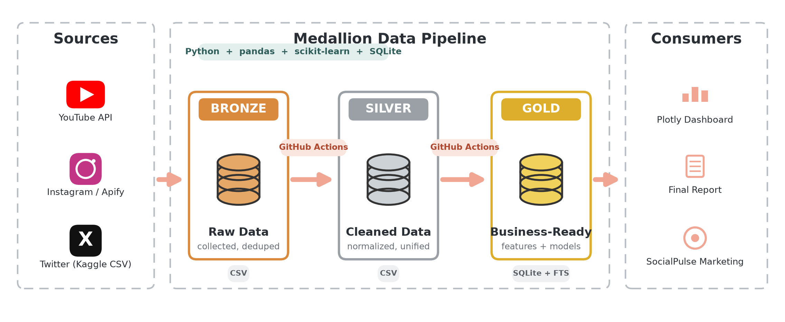
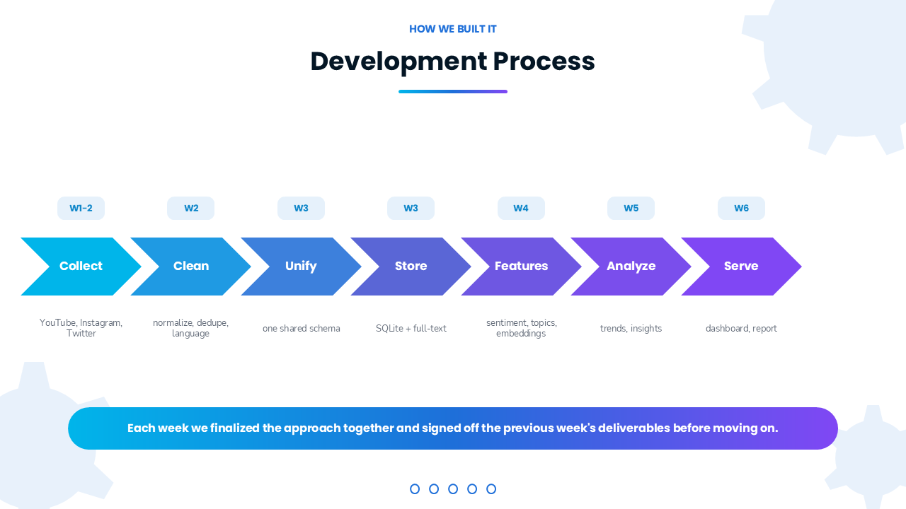
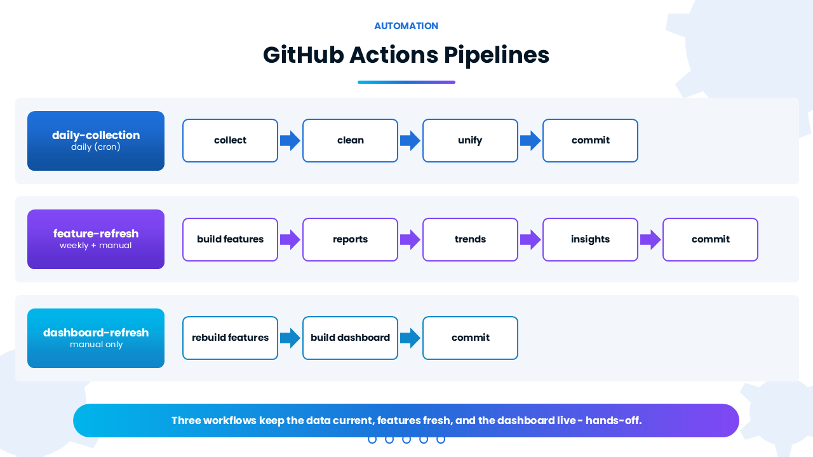
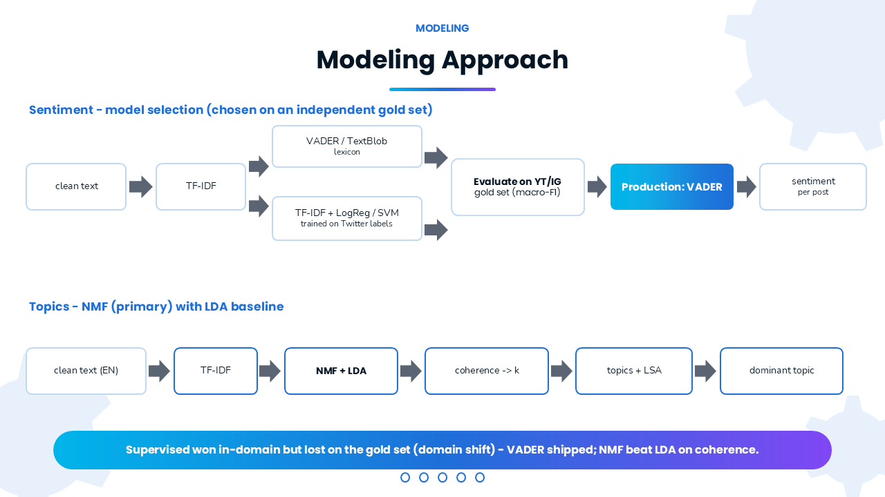

# SocialPulse Market Intelligence

> **Capstone Project** — A social media analytics pipeline for identifying emerging trends,
> audience sentiment, engagement patterns, and business opportunities from technology-focused
> public discussions across YouTube, Instagram, and Twitter/X.

---

## Team (Group 8)

| Name | Roll No |
|------|---------|
| Shifali Chandra | G25AI1040 |
| Rubansakthi KL | G25AI1036 |
| Ruchit Gandhi | G25AI1037 |
| Ruchita Bhandari | G25AI1038 |

---

## Table of Contents

1. [Project Overview](#project-overview)
2. [Focus Areas](#focus-areas)
3. [Architecture](#architecture)
4. [Methodology & Tech Stack](#methodology--tech-stack)
5. [Repository Structure](#repository-structure)
6. [Setup & Running](#setup--running)
7. [Automation](#automation)
8. [Modelling Approach](#modelling-approach)
9. [Key Results](#key-results)
10. [Dataset Summary](#dataset-summary)
11. [Known Limitations](#known-limitations)

---

## Project Overview

SocialPulse Market Intelligence collects, processes, and analyses public social media discussions
to generate actionable marketing insights. The project targets technology and digital-business
topics across **YouTube**, **Instagram**, and **Twitter/X**, helping marketing teams make
data-driven decisions on trend analysis, sentiment, and engagement.

Data flows through a **medallion architecture**: raw platform data is progressively cleaned,
unified, enriched with NLP features (sentiment, topics, embeddings, engagement), stored in a
SQLite feature store with full-text search, and surfaced as an interactive dashboard and reports.

---

## Focus Areas

| Category | Keywords |
|----------|----------|
| **Artificial Intelligence & Automation** | ChatGPT · AI Agents · Automation |
| **Cloud & Data Technologies** | AWS · Databricks · Data Engineering |
| **Digital Marketing** | Digital Marketing · SEO · Influencer Marketing |
| **Digital Business & Startups** | Startup · SaaS · Digital Transformation |

---

## Architecture

### Medallion Architecture



*Sources → Bronze (raw CSV) → Silver (cleaned, unified CSV) → Gold (features + models in SQLite) → Serving (dashboard, report). Stack: Python + pandas + scikit-learn + SQLite. Automated with GitHub Actions.*

### Development Process (W1 – W6)



*W1-2 Collect → W2 Clean → W3 Unify → W3 Store → W4 Features → W5 Analyse → W6 Serve*

---

## Methodology & Tech Stack

| Tool / Library | Purpose |
|----------------|---------|
| Python 3 | Core language |
| YouTube Data API v3 | YouTube comment collection |
| Apify Instagram Hashtag Scraper | Instagram post collection |
| Twitter/X — public Kaggle dataset | Static EDA-only dataset |
| Pandas | Data wrangling |
| scikit-learn | TF-IDF, NMF/LDA, LinearSVC, LogisticRegression, TruncatedSVD/LSA |
| NLTK / VADER / TextBlob | Sentiment scoring |
| langdetect | Language detection |
| SQLite (FTS5) | Feature store, full-text search |
| Matplotlib / Seaborn / WordCloud | Visualisation |
| Plotly | Interactive dashboard |
| Jupyter Notebook | EDA & feature-engineering notebooks |
| GitHub Actions | Scheduled daily collection + weekly refresh pipelines |
| Git & GitHub | Version control |

> **Note on Reddit:** Reddit was evaluated as a data source but **dropped from scope**.
> Reddit's API requires a manual data-access application that was not approved within the
> project timeline. Reddit was replaced with Instagram (Apify Hashtag Scraper) and a public
> Twitter/X Kaggle dataset.

---

## Repository Structure

```
.github/workflows/
├── daily-collection.yml      # Daily: collect → clean → unify → commit
├── feature-refresh.yml       # Weekly + manual: features → reports → trends → insights → commit
└── dashboard-refresh.yml     # Manual: rebuild features → build dashboard → commit

data/
├── raw/                      # Immutable source datasets (youtube, instagram, twitter)
├── clean/                    # Cleaned per-platform CSVs + unified_dataset + features_dataset
├── gold/                     # Labeled sentiment gold set (model validation)
├── processed/                # LSA/SVD embeddings (embeddings.npy)
└── reports/                  # Profiling, model_eval, feature reports, trends, dashboard, EDA
    ├── eda/
    ├── features/
    ├── model_eval/
    ├── trends/
    ├── dashboard.html        # Interactive Plotly dashboard
    ├── insights_summary.md  # Auto-generated key-findings summary
    ├── instagram/
    ├── twitter/
    └── youtube/

diagrams/                     # Architecture and pipeline diagrams (PNG)

docs/
├── architecture.md
├── feature_engineering.md   # Feature definitions, model leaderboards, limitations
├── methodology_report.md
├── final_report.md          # Final marketing-insights report
└── ai_tool_usage.md         # AI tool usage documentation

models/
├── nmf_model.joblib          # Fitted NMF topic model (k=9)
├── sentiment_best.joblib     # Production sentiment model
└── tfidf_vectorizer.joblib   # Fitted TF-IDF vectorizer (topic)

notebooks/
├── eda.ipynb
├── 04_feature_engineering.ipynb
└── 05_analysis.ipynb         # Sentiment plots, validation metrics, trend analysis

src/
├── youtube_collector.py
├── instagram_collector.py
├── collector_utils.py        # Incremental append + deduplicate
├── data_profiler.py
├── data_cleaner.py
├── build_unified_dataset.py
├── text_features.py          # Language detection, clean_text, structural counts
├── sentiment_model.py        # Lexicon + supervised sentiment + benchmark
├── topic_model.py            # TF-IDF → NMF/LDA topics + LSA embeddings
├── engagement_features.py    # Within-platform engagement transforms
├── build_features.py         # Feature-engineering orchestrator
├── load_features_db.py       # SQLite feature store + indexes + FTS5
├── make_feature_reports.py   # Marketing summary reports
├── trends.py                 # Time-series trend analysis
├── make_insights.py          # Auto-generated key-findings summary
├── build_dashboard.py        # Interactive Plotly dashboard
├── sentiment_gold_label.py   # Gold-set sampling
└── sentiment_gold_eval.py    # Deploy-domain model evaluation

requirements.txt
```

---

## Setup & Running

```bash
# 1. Create virtual environment and install dependencies
python -m venv .venv
.venv\Scripts\pip install -r requirements.txt

# 2. Register Jupyter kernel
.venv\Scripts\python -m ipykernel install --user --name socialpulse --display-name "Python (SocialPulse)"

# 3. Create a .env file with your API keys (gitignored)
#    API_KEY=<your YouTube Data API v3 key>
#    APIFY_API_KEY=<your Apify API key>
```

### Running the Pipeline Manually

```bash
# Collection
python src/youtube_collector.py
python src/instagram_collector.py

# Cleaning & profiling
python src/data_cleaner.py data/raw/youtube_master_dataset.csv
python src/data_cleaner.py data/raw/instagram_master_dataset.csv

# Unified dataset
python src/build_unified_dataset.py

# Feature engineering
python src/build_features.py

# Load into SQLite
python src/load_features_db.py

# Trend analysis & insights
python src/trends.py
python src/make_insights.py

# Build interactive dashboard
python src/build_dashboard.py

# Marketing summary reports
python src/make_feature_reports.py
```

Open `notebooks/eda.ipynb`, `notebooks/04_feature_engineering.ipynb`, or
`notebooks/05_analysis.ipynb` with the **"Python (SocialPulse)"** kernel.

---

## Automation



Three GitHub Actions workflows keep data current hands-off:
- **daily-collection** (daily cron): collect → clean → unify → commit
- **feature-refresh** (weekly + manual): build features → reports → trends → insights → commit
- **dashboard-refresh** (manual): rebuild features → build dashboard → commit

API keys (`API_KEY`, `APIFY_API_KEY`) are stored as GitHub repository Secrets. Twitter is static and excluded from all scheduled runs.

---

## Modelling Approach



*Sentiment: clean text → TF-IDF → lexicon (VADER / TextBlob) vs. supervised (TF-IDF + LogReg/SVM trained on Twitter) → evaluated on independent YT/IG gold set (macro-F1) → **Production: TextBlob**. Topics: NMF + LDA → coherence sweep → k → LSA embeddings → dominant topic per post.*

### Sentiment Model Leaderboard

**In-domain** (held-out 20% of 91,886 English Twitter tweets):

| Model | Macro-F1 | Accuracy |
|-------|----------|----------|
| TF-IDF + LinearSVC | 0.893 | 0.946 |
| TF-IDF + LogisticRegression | 0.850 | 0.921 |
| TF-IDF + Naive Bayes | 0.779 | 0.873 |
| VADER | 0.680 | 0.711 |
| TextBlob | 0.511 | 0.623 |
| Majority baseline | 0.267 | 0.668 |

**Deploy-domain gold set** (~180 YouTube + Instagram rows, platform-stratified, `data/gold/sentiment_gold.csv`):

| Model | Macro-F1 (gold) | Accuracy |
|-------|-----------------|----------|
| **TextBlob** ✅ | **0.624** | 0.756 |
| VADER | 0.572 | 0.767 |
| TF-IDF + LinearSVC | 0.507 | 0.717 |

The supervised model that won in-domain (0.893) drops to 0.507 on the deploy domain — classic domain shift (Twitter AWS / pre-ChatGPT vocabulary vs. 2026 YT/IG AI content). **TextBlob is the production scorer**, chosen by macro-F1 on the independent gold set.

### Feature-Rich Dataset

`data/clean/features_dataset.csv` — **~14,300 rows, 37 columns**

| Group | Columns |
|-------|---------|
| Identity | post_id, Platform, Keyword, Author, Published Date, Content, clean_text |
| Language | lang, sentiment_reliable |
| Structural | char_len, word_count, avg_word_len, hashtag_count, mention_count, url_count, emoji_count, uppercase_ratio, exclaim_count, question_count |
| Sentiment | vader_compound, textblob_polarity, textblob_subjectivity, sentiment_label, sentiment_score, sentiment_model |
| Topic | dominant_topic_id, dominant_topic_label, topic_weight |
| Engagement | engagement_raw, engagement_log, engagement_pct_within_platform, engagement_high, engagement_tier |
| Time | pub_year, pub_month, pub_dayofweek, pub_is_weekend |

---

## Key Results

> **Snapshot note:** Analytical findings (sentiment %, topic rankings, volume trends) are produced by the **feature-refresh** pipeline and update each time it runs. Numbers below reflect the **Week 6 collection snapshot**.

### Pipeline & Engineering
- ✅ End-to-end medallion pipeline: Bronze → Silver → Gold → Serving
- ✅ Automated daily collection via GitHub Actions (incremental + deduplicated)
- ✅ Unified cross-platform schema (YouTube + Instagram, ~14,300 rows modeling-ready)
- ✅ Feature-engineering pipeline → 37-column feature-rich dataset
- ✅ SQLite feature store: 7 b-tree indexes + FTS5 full-text search
- ✅ Interactive Plotly dashboard ([data/reports/dashboard.html](data/reports/dashboard.html))
- ✅ Final report & AI-tool-usage notes ([docs/final_report.md](docs/final_report.md), [docs/ai_tool_usage.md](docs/ai_tool_usage.md))

### Sentiment Analysis
- ✅ **Instagram is ~86% positive**; **YouTube is ~66% positive** — Instagram surfaces stronger community enthusiasm, YouTube more mixed feedback
- ✅ Sentiment is **stable and strongly positive** across the collection window
- ✅ **Engagement is flat across sentiment** — positive content does not drive more engagement than negative; reach should not be chased through sentiment alone
- ✅ TextBlob selected as production scorer (macro-F1 0.624 on independent gold set); supervised models collapsed due to domain shift from pre-ChatGPT Twitter data

### Topic & Trend Analysis
- ✅ **Business & Startup** is the largest and fastest-rising theme across the dataset
- ✅ **ChatGPT usage** is an emerging topic — its share is growing in the recent collection window vs. the earlier window, a concrete early signal for campaign planning
- ✅ Top keywords by volume: **ChatGPT · Automation · Startup · AI Agents**
- ✅ Volume is rising week-on-week as the continuous collection pipeline accumulates data
- ✅ NMF (k=9, coherence-selected) surfaces content themes such as business/startup, online courses, AI agents — confirmed against LDA baseline (NMF UMass −1.00 vs LDA −2.78)

### Strategic Signals for SocialPulse
> These are the actionable outcomes the pipeline delivers:
- **Platform strategy:** Use Instagram for positive community-building; use YouTube for gathering feedback and mixed discussion.
- **Campaign themes:** Build content around the rising themes — business, AI tools, ChatGPT, and automation.
- **Engagement insight:** Sentiment does not drive engagement — focus campaigns on relevance and topic alignment, not tone alone.
- **Evergreen pipeline:** Because collection is automated and continuous, these insights improve over time without manual effort.

---

## Dataset Summary

YouTube and Instagram grow daily via the scheduled pipeline; counts below are a **Week 6 snapshot** and update on every feature-refresh run.

| Dataset | Records | Use |
|---------|---------|-----|
| YouTube Comments (raw) | ~12,400 (growing daily) | Analysis + modelling |
| Instagram Posts (raw) | ~1,900 (growing daily) | Analysis + modelling |
| Twitter Tweets (keyword-matched) | 84,212 (static) | EDA only (AWS-biased) |
| Unified / Feature dataset | ~14,300 (growing daily) | Modelling-ready |
| Sentiment Gold Set | ~180 rows | Deploy-domain model evaluation |
| Keywords Covered | 12 | 4 categories |

---

## Known Limitations

- **Domain shift:** Supervised models trained on pre-ChatGPT Twitter data transfer poorly to 2026 YouTube/Instagram AI content; lexicon models (TextBlob/VADER) are more robust cross-domain.
- **Small Instagram sample:** n ≈ 1,900 posts (~24/keyword at start, growing) — per-keyword conclusions are directional only; per-platform findings are reliable.
- **Twitter EDA-only:** ~99% of keyword-matched tweets are AWS-related and lack reliable timestamps, making Twitter unsuitable for modeling or time-series analysis.
- **Gold labels are LLM-assigned:** No human annotators; treated as a documented weak-supervision proxy for the deploy-domain evaluation.

---

## Future Enhancements

- Semantic (sentence-transformer) embeddings to replace LSA
- Title/caption-based topic modeling for sharper emerging-topic themes
- Comment-graph network analysis of user interactions

